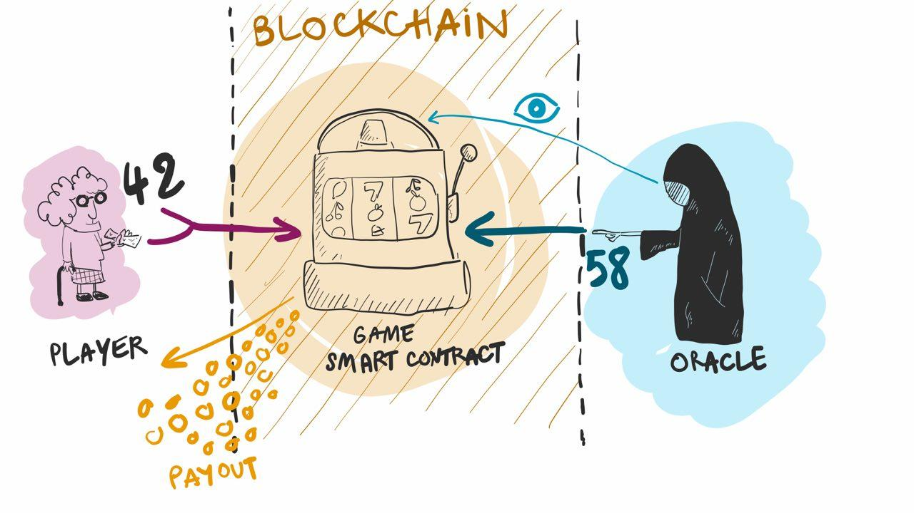

A Game with an oracle
=====================

In this small tutorial, we will see how to write a chance game on the
Dune blockchain with Liquidity and a small external oracle which
provides random numbers.

Principle of the game
---------------------

Rules of the game are handled by a smart contract on the Dune
blockchain.

When a player decides to start a game, she must start by making a
transaction (*i.e.* a call) to the game smart contract with a number
parameter (let's call it ``n``) between 0 and 100 (inclusively). The
amount that is sent with this transaction constitute her bet ``b``.

A random number ``r`` is then chosen by the oracle and the outcome of
the game is decided by the smart contract.

* The player **loses** if her number ``n`` is *greater* than ``r``. In
  this case, she forfeits her bet amount and the game smart contract
  is resets (the money stays on the game smart contract).

* The player **wins** if her number ``n`` is *smaller or equal* to
  ``r``. In this case, she gets back her initial bet ``b`` plus a
  reward which is proportional to her bet and her chosen number ``b *
  n / 100``. This means that a higher number ``n``, while being a
  riskier choice (the following random number must be greater), yields
  a greater reward. The edge cases being ``n = 0`` is an always
  winning input but the reward is always null, and ``n = 100`` wins
  only if the random number is also ``100`` but the player doubles her
  bet.

Architecture of the DApp
------------------------

Everything that happens on the blockchain is deterministic and
reproducible which means that smart contracts cannot generate random
numbers securely [#f1]_ .

The following smart contract works in this manner. Once a user starts
a game, the smart contract is put in a state where it awaits a random
number from a trusted off-chain source. This trusted source is our
random generator oracle. The oracle monitors the blockchain and
generates and sends a random number to the smart contract once it
detects that it is waiting for one.

Because the oracle waits for a ``play`` transaction to be included in
a block and sends the random number in a subsequent block, this means
that a game round lasts at least two blocks [#f2]_ .

This technicality forces us to split our smart contract into two
distinct entry points:

#. A first entry point ``play`` is called by a player who wants to
   start a game (it cannot be called twice). The code of this entry
   point saves the game parameters in the smart contract storage and
   stops execution (awaiting a random number).

#. A second entry point ``finish``, which can only be called by the
   oracle, accepts random numbers as parameter. The code of this entry
   point computes the outcome of the current game based on the game
   parameters and the random number, and then proceeds accordingly. At
   the end of ``finish`` the contract is reset and a new game can be
   started.

The Game Smart Contract
-----------------------

The smart contract game manipulates a storage of the following type:

.. code-block:: OCaml

   type game = {
     number : nat;
     bet : tez;
     player : key_hash;
   }

   type storage = {
     game : game option;
     oracle_id : address;
   }

The storage contains the address of the oracle, ``oracle_id``. It will
only accept transactions coming from this address (*i.e.* that are
signed by the corresponding private key). It also contains an optional
value ``game`` that indicates if a game is being played or not.

A game consists in three values, stored in a record:

#. ``number`` is the number chosen by the player.
#. ``bet`` is the amount that was sent with the first transaction by
   the player. It constitute the bet amount.
#. ``player`` is the key hash (tz1...) on which the player who made
   the bet wishes to be payed in the event of a win (we ask for a
   ``key_hash`` so that the payout operation cannot fail).

We also give an initializer function that can be used to deploy the
contract with an initial value. It takes as argument the address of
the oracle, which cannot be changed later on.

.. code-block:: OCaml

   let%init storage (oracle_id : address) =
     { game = None; oracle_id }

The ``play`` entry point
~~~~~~~~~~~~~~~~~~~~~~~~

The first entry point, ``play`` takes as argument a pair composed of:
- a natural number, which is the number chosen by the player
- and a key hash, which is the address on which a player wishes to be
  payed as well as the current storage of the smart contract.

.. code-block:: OCaml

   let%entry play (number : nat) storage = ...

The first thing this contract does is validate the inputs:

#. Ensure that the number is a valid choice, *i.e.* is between 0
   and 100 (natural numbers are always greater or equal to 0).

   .. code-block:: OCaml

      if number > 100p then failwith "number must be <= 100";

#. Ensure that the contract has enough funds to pay the player in case
   she wins. The highest paying bet is to play ``100`` which means
   that the user gets payed twice its original bet amount. At this
   point of the execution, the balance of the contract is already
   credited with the bet amount, so this check comes to ensuring that
   the balance is greater than twice the bet.

   .. code-block:: OCaml

      if 2p * Current.amount () > Current.balance () then
        failwith "I don't have enough money for this bet";

#. Ensure that no other game is currently being played so that a
   previous game is not erased.

   .. code-block:: OCaml

      match storage.game with
      | Some g ->
        failwith ("Game already started with", g)
      | None ->
        (* Actual code of entry point *)

The rest of the code for this entry point consist in simply creating a
new ``game`` record ``{ number; bet; player }`` and saving it to the
smart contract's storage. This entry point always returns an empty
list of operations because it does not make any contract calls or
transfers.

.. code-block:: OCaml

   let bet = Current.amount () in
   let storage = storage.game <- Some { number; bet; player } in
   ([], storage)

The new storage is returned and the execution stops at this point,
waiting for someone (the oracle) to call the ``finish`` entry point.

The ``finish`` entry point
~~~~~~~~~~~~~~~~~~~~~~~~~~

The second entry point, ``finish`` takes as argument a natural number
parameter, which is the random number generated by the oracle, as well
as the current storage of the smart contract.

.. code-block:: OCaml

   let%entry finish (random_number : nat) storage = ...

The random number can be any natural number (these are mathematically
unbounded natural numbers) so we must make sure it is between 0 and
100 before proceeding. Instead of rejecting too big random numbers, we
simply (Euclidean) divide it by 101 and keep the remainder, which is
between 0 and 100. The oracle already generates random numbers between
0 and 100 so this operation will do nothing but is interesting to keep
if we want to replace the random generator one day.

.. code-block:: OCaml

  let random_number = match random_number / 101p with
    | None -> failwith ()
    | Some (_, r) -> r in

Smart contracts are public objects on the Dune blockchain so anyone
can decide to call them. This means that permissions must be handled
by the logic of the smart contract itself. In particular, we don't
want ``finish`` to be callable by anyone, otherwise it would mean that
the player could choose its own random number. Here we make sure that
the call comes from the oracle.

.. code-block:: OCaml

  if Current.sender () <> storage.oracle_id then
    failwith ("Random numbers cannot be generated");

We must also make sure that a game is currently being played otherwise
this random number is quite useless.

.. code-block:: OCaml

  match storage.game with
  | None -> failwith "No game already started"
  | Some game -> ...

The rest of the code in the entry point decides if the player won or
lost, and generates the corresponding operations accordingly.

.. code-block:: OCaml

      if random_number < game.number then
        (* Lose *)
        []

If the random number is smaller that the chosen number, the player
lost. In this case no operation is generated and the money is kept by
the smart contract.

.. code-block:: OCaml

      else
        (* Win *)
        let gain = match (game.bet * game.number / 100p) with
          | None -> 0tz
          | Some (g, _) -> g in
        let reimbursed = game.bet + gain in
        [ Account.transfer ~dest:game.player ~amount:reimbursed ]

Otherwise, if the random number is greater or equal to the previously
chosen number, then the player won. We compute her gain and the
reimbursement value (which is her original bet + her gain) and
generate a transfer operation with this amount.

.. code-block:: OCaml

    let storage = storage.game <- None in
    (ops, storage)

Finally, the storage of the smart contract is reset, meaning that the
current game is erased. The list of generated operations and the
reset storage is returned.

A safety entry point: ``default``
~~~~~~~~~~~~~~~~~~~~~~~~~~~~~~~~~

At anytime we authorize anyone (most likely the manager of the
contract) to add funds to the contract's balance. This allows new
players to participate in the game even if the contract has been
depleted, by simply adding more funds to it.

.. code-block:: OCaml

   let%entry fund () storage =
     [], storage

This code does nothing, excepted accepting transfers with amounts.

Full Liquidity Code of the Game Smart Contract
~~~~~~~~~~~~~~~~~~~~~~~~~~~~~~~~~~~~~~~~~~~~~~

.. tryliquidity:: ../../../../tests/others/game.liq
.. literalinclude:: ../../../../tests/others/game.liq
  :language: OCaml

The Oracle
----------

The oracle can be implemented using `Dune Network RPCs
<https://dune.network/docs/dune-node-mainnet/api/rpc.html>`_ on a running Dune
node. The principle of the oracle is the following:

#. Monitor new blocks in the chain.
#. For each new block, look if it includes **successful** transactions
   whose *destination* is the *game smart contract*.
#. Look at the parameters of the transaction to see if it is a call to
   either ``play``, ``finish`` or ``fund``.
#. If it is a successful call to ``play``, then we know that the smart
   contract is awaiting a random number.
#. Generate a random number between 0 and 100 and make a call to the
   game smart contract with the appropriate private key (the
   transaction can be signed by a Ledger plugged to the oracle server
   for instance).
#. Wait a small amount of time depending on blocks intervals.
#. Loop.

These can be implemented with the following RPCs:

* Monitoring blocks: `/chains/main/blocks?[length=<int>]
  <https://dune.network/docs/dune-node-mainnet/api/rpc.html#get-chains-chain-id-blocks>`_

* Listing operations in blocks:
  `/chains/main/blocks/<block_id>/operations/3
  <https://dune.network/docs/dune-node-mainnet/api/rpc.html#get-block-id-operations-list-offset>`_

* Getting the storage of a contract:
  `/chains/main/blocks/<block_id>/context/contracts/<contract_id>/storage
  <https://dune.network/docs/dune-node-mainnet/api/rpc.html#get-block-id-context-contracts-contract-id-storage>`_

* Making transactions or contract calls:

  * Either call the ``dune-client`` binary (easiest if running on a
    server).
  * Call the ``liquidity file.liq --call ...`` binary (private key must
    be in plain text so it is not recommended for production servers).
  * Or build transaction manually, sign and inject. This can be done
    with:

      * `/chains/main/blocks/head/helpers/forge/operations
        <https://dune.network/docs/dune-node-mainnet/api/rpc.html#post-block-id-helpers-forge-operations>`_
      * Signing must be done locally:

          #. prepend bytes ``03``
          #. hash with `Blake2B
             <https://en.wikipedia.org/wiki/BLAKE_(hash_function)#BLAKE2b_algorithm>`_
          #. Sign with either ed25519, secp256k1, p256 depending on
             your private key

      * `/chains/main/blocks/head/helpers/scripts/run_operation <https://dune.network/docs/dune-node-mainnet/api/rpc.html#post-block-id-helpers-scripts-run-operation>`_
      * `/injection/operation <https://dune.network/docs/dune-node-mainnet/api/rpc.html#post-injection-operation>`_

An implementation of a random number Oracle in OCaml (which uses the
liquidity client to make transactions) can be found in this
repository: `<https://github.com/OCamlPro/liq_game/blob/master/src/crawler.ml>`_.

Remarks
-------

#. In this game, the oracle must be trusted and so it can cheat. To
   mitigate this drawback, the oracle can be used as a random number
   generator for several games, if random values are stored in an
   intermediate contract.

#. If the oracle looks for events in the last baked block (head), then
   it is possible that the current chain will be discarded and that
   the random number transaction appears in another chain. In this
   case, the player that sees this happen could potentially play
   another game with a chosen number if she sees the random number in
   the mempool. However, in Dune, operations include a block hash to
   designate a particular branch so the random number transaction
   would not be valid in this other branch.

.. rubric:: Footnotes

.. [#f1] Some contracts on Ethereum use block hashes as sources of
         randomness but these are easily manipulated by miners so they
         are not safe to use. There are also ways to have participants
         contribute parts of a random number with enforceable
         commitments `<https://github.com/randao/randao>`_.

.. [#f2] The random number could technically be sent in the same block
         by monitoring the mempool but it is not a good idea because
         the miner could reorder the transactions which will make both
         of them fail, or worse she could replace her bet accordingly
         once she sees a random number in her mempool.
